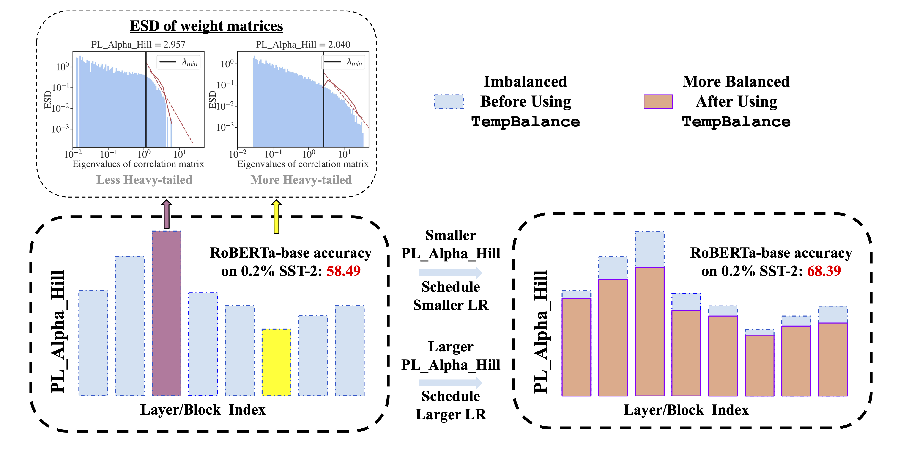

# Model Balancing Helps Low-data Training and Fine-tuning [EMNLP 2024 Main Track]
[Zihang Liu](https://zihanghliu.github.io), [Yuanzhe Hu](https://github.com/HUST-AI-HYZ), [Tianyu Pang](), [Yefan Zhou](https://yefanzhou.github.io/), [Pu Ren](https://paulpuren.github.io/), [Yaoqing Yang](https://sites.google.com/site/yangyaoqingcmu/)  

[Paper](https://arxiv.org/abs/2410.12178)

## Introduction
In this work, we show that model training quality with limited data can be interpreted from a HT-SR perspective. We analyze the ESD of individual layers and propose to use shape metrics (PL_Alpha_Hill) from these ESDs to quantify the quality of individual layers, and assign different learning rates to different layers based on their PL_Alpha_Hill, namely TempBalance. We show that TempBalance achieves better layer-wise quality alignment that improve low-data training in NLP and SciML tasks.

<p align="center">
    
</p>


## Main Result on LLM Fine-tuning: Full Fine-tuning RoBERTa-base with TempBalance (TB) on GLUE Tasks

<p align="center">
    
</p>

### Environment Setup
```bash
# create conda env and install packages from requirements.txt
conda create -n ww_finetune python=3.8
conda activate ww_finetune
pip install -r requirements.txt

# setup transformer library from local source
conda activate ww_finetune
cd transformers
pip install -e .
pip install accelerate -U
```

### Reproducing the Results on QNLI Dataset
```bash
# Full FT baseline
bash ./bash_scripts/run_glue_baseline_roberta_base_ratio.sh

# Our method TempBalance
bash ./bash_scripts/run_glue_block_tb_sigmoid_roberta_base_ratio.sh
```

## Main Result on Neural PDE: Training FNO Model on 2D Compressible Navier-Stokes Dataset

<p align="center">
    
</p>

### Environment Setup
```bash
cd sciml
conda create -n ww_sciml python=3.8
conda activate ww_sciml
pip install -r requirements_sciml.txt
```

### Dataset Preperation
1. Download data from external source
```bash
cd ./sciml/pdebench/data_download
python download_direct.py --root_folder $your_proj_home_dir/sciml/data --pde_name 2d_cfd_tbv2
```
2. Customize the config file named ./sciml/pdebench/models/config/args/config_2DCFD_TB.yaml to your own directory. Change the following lines in the file: 
```
train_log_path: '$your_proj_home_dir/sciml/pdebench/logs/'
checkpoint_path: '$your_proj_home_dir/sciml/pdebench/checkpoints/'
data_path: '$your_proj_home_dir/sciml/data/2D/CFD/2D_Train_Rand/'
```
(Note that training data usually requires up to several minutes to load.)

## Reproducing the Results of Training FNO Model on 2D Compressible Navier-Stokes Dataset
```bash
bash ./bash_scripts/reduce_batch_fno.sh
```
